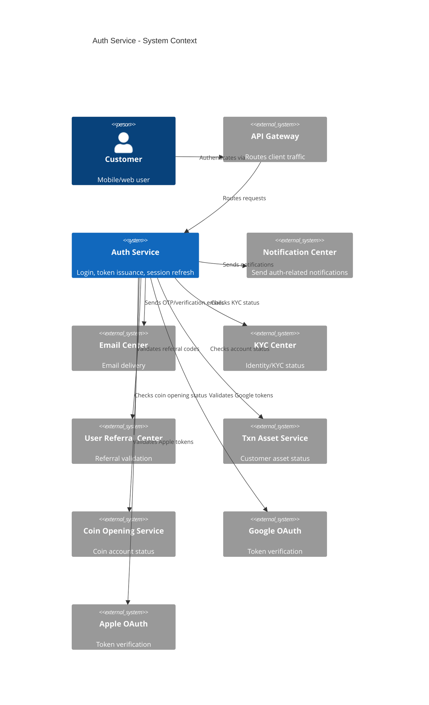
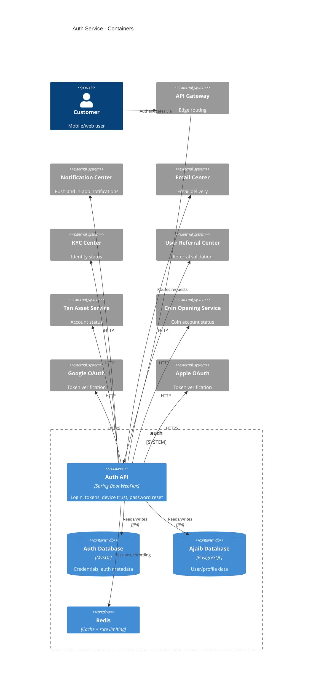
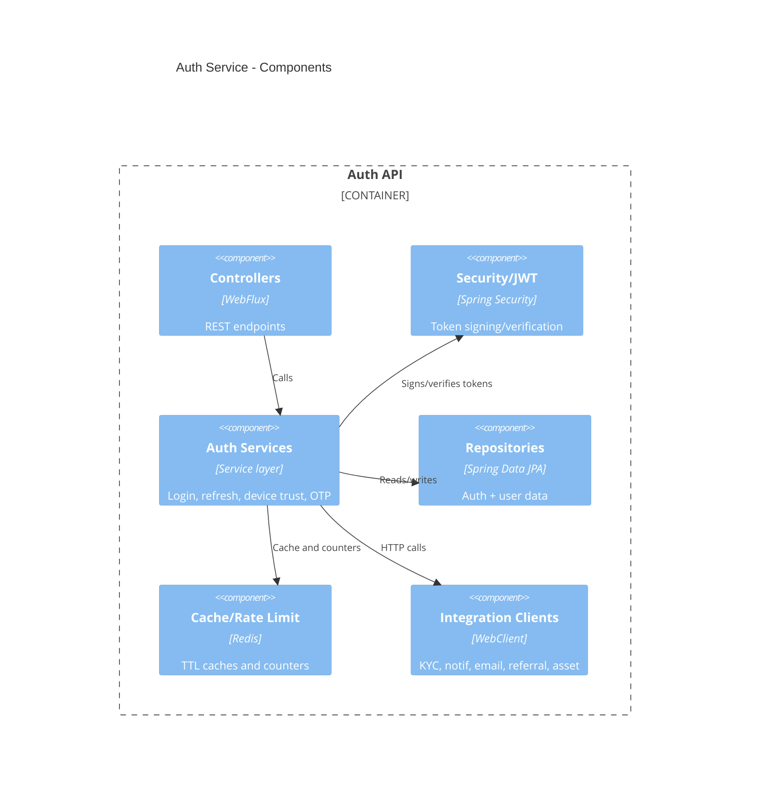
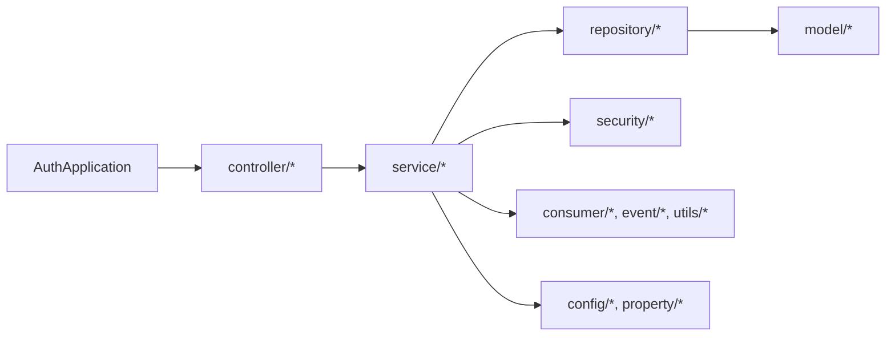

# auth - C4 Architecture

## Context

```mermaid
C4Context
title Auth Service - System Context
Person(customer, "Customer", "Mobile/web user")
System_Ext(api_gateway, "API Gateway", "Routes client traffic")
System(auth, "Auth Service", "Login, token issuance, session refresh")
System_Ext(notif_center, "Notification Center", "Send auth-related notifications")
System_Ext(email_center, "Email Center", "Email delivery")
System_Ext(kyc_center, "KYC Center", "Identity/KYC status")
System_Ext(referral_center, "User Referral Center", "Referral validation")
System_Ext(asset_service, "Txn Asset Service", "Customer asset status")
System_Ext(coin_opening, "Coin Opening Service", "Coin account status")
System_Ext(google_oauth, "Google OAuth", "Token verification")
System_Ext(apple_oauth, "Apple OAuth", "Token verification")
Rel(customer, api_gateway, "Authenticates via")
Rel(api_gateway, auth, "Routes requests")
Rel(auth, notif_center, "Sends notifications")
Rel(auth, email_center, "Sends OTP/verification emails")
Rel(auth, kyc_center, "Checks KYC status")
Rel(auth, referral_center, "Validates referral codes")
Rel(auth, asset_service, "Checks account status")
Rel(auth, coin_opening, "Checks coin opening status")
Rel(auth, google_oauth, "Validates Google tokens")
Rel(auth, apple_oauth, "Validates Apple tokens")
```

## Container

```mermaid
C4Container
title Auth Service - Containers
Person(customer, "Customer", "Mobile/web user")
System_Ext(api_gateway, "API Gateway", "Edge routing")
System_Boundary(auth_boundary, "auth") {
  Container(auth_api, "Auth API", "Spring Boot WebFlux", "Login, tokens, device trust, password reset")
  ContainerDb(auth_db, "Auth Database", "MySQL", "Credentials, auth metadata")
  ContainerDb(ajaib_db, "Ajaib Database", "PostgreSQL", "User/profile data")
  Container(cache, "Redis", "Cache + rate limiting")
}
System_Ext(notif_center, "Notification Center", "Push and in-app notifications")
System_Ext(email_center, "Email Center", "Email delivery")
System_Ext(kyc_center, "KYC Center", "Identity status")
System_Ext(referral_center, "User Referral Center", "Referral validation")
System_Ext(asset_service, "Txn Asset Service", "Account status")
System_Ext(coin_opening, "Coin Opening Service", "Coin account status")
System_Ext(google_oauth, "Google OAuth", "Token verification")
System_Ext(apple_oauth, "Apple OAuth", "Token verification")
Rel(customer, api_gateway, "Authenticates via")
Rel(api_gateway, auth_api, "Routes requests")
Rel(auth_api, auth_db, "Reads/writes", "JPA")
Rel(auth_api, ajaib_db, "Reads/writes", "JPA")
Rel(auth_api, cache, "Sessions, throttling")
Rel(auth_api, notif_center, "HTTP")
Rel(auth_api, email_center, "HTTP")
Rel(auth_api, kyc_center, "HTTP")
Rel(auth_api, referral_center, "HTTP")
Rel(auth_api, asset_service, "HTTP")
Rel(auth_api, coin_opening, "HTTP")
Rel(auth_api, google_oauth, "HTTPS")
Rel(auth_api, apple_oauth, "HTTPS")
```

## Component

```mermaid
C4Component
title Auth Service - Components
Container_Boundary(auth_api, "Auth API") {
  Component(controller, "Controllers", "WebFlux", "REST endpoints")
  Component(security, "Security/JWT", "Spring Security", "Token signing/verification")
  Component(service, "Auth Services", "Service layer", "Login, refresh, device trust, OTP")
  Component(repo, "Repositories", "Spring Data JPA", "Auth + user data")
  Component(cache, "Cache/Rate Limit", "Redis", "TTL caches and counters")
  Component(clients, "Integration Clients", "WebClient", "KYC, notif, email, referral, asset")
}
Rel(controller, service, "Calls")
Rel(service, security, "Signs/verifies tokens")
Rel(service, repo, "Reads/writes")
Rel(service, cache, "Cache and counters")
Rel(service, clients, "HTTP calls")
```

## Code

```mermaid
flowchart LR
  auth_app["AuthApplication"] --> controller["controller/*"]
  controller --> service["service/*"]
  service --> repository["repository/*"]
  service --> security["security/*"]
  service --> client["consumer/*, event/*, utils/*"]
  repository --> model["model/*"]
  service --> config["config/*, property/*"]
```
